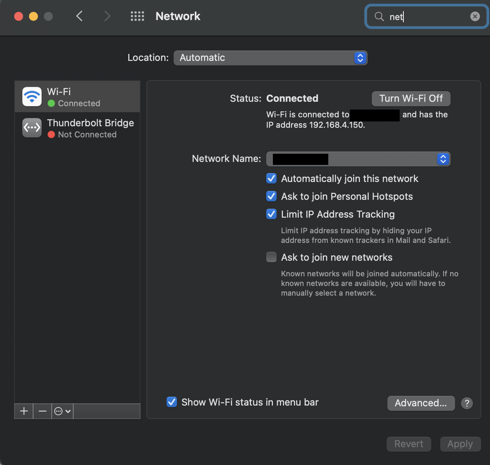
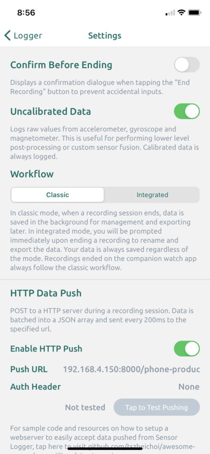
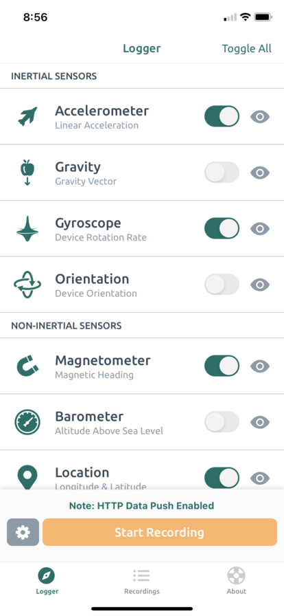

# smartphone_sensor_stream

Stream smartphone data from Sensor Logger (see https://github.com/tszheichoi/awesome-sensor-logger#the-sensor-logger-app) with FastAPI, Kafka, ksqlDB, and Docker. A quick demo is available on YouTube: https://www.youtube.com/shorts/zRUVvz5vsl8

## Getting Started
1. Make sure Docker Compose is installed on your machine: https://docker-docs.netlify.app/compose/install/
2. Install Sensor Logger on your smartphone: https://www.tszheichoi.com/sensorlogger
3. Ensure that your smartphone and host machine are on the same WI-FI network, and identify the IP address of your host machine. On Mac, this can be found under System Preferences -> Network:

4. In Sensor Logger's settings, in the "Push URL" box, enter http://{your_ip_address}:8000/phone-producer :

5. From the command line, run `docker-compose up --build` in the same directory as the `docker-compose.yml` file.

6. Wait for build to complete and visit http://localhost:4200 on the host machine. Click "Start Recording" in Sensor Logger:

7. On the dashboard, click "Start Streaming", and
data should begin displaying:

